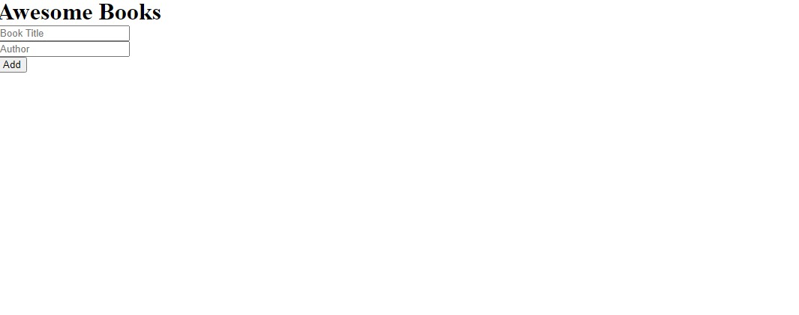

# Awesome-books

This is a project on a book list app that adds, removes and stores books in local storage.

## Built With

- HTML, CSS & JS
- Git & Github workflows

## Live Demo

Click[here](https://chidiebereojingwa.github.io/conference-page/) to view the page.

## Built With
HTML
CSS
JavaScript
### Setup
clone to you local machine
create a directory on a your local machin.
open your terminal and type: git clone. https://github.com/chidiebereojingwa/conference-page.git
### Usage
Clone project to your local machine 
run the index.html
## Live Demo
https://chidiebereojingwa.github.io/conference-page/
## Authors

👤 **Chidiebere Ojingwa**

- GitHub: [@githubhandle](https://github.com/chidiebereojingwa)
- Twitter: [@twitterhandle](https://twitter.com/ojingwa)
- LinkedIn: [LinkedIn](https://linkedin.com/in/chidiebereojingwa)

## Acknowledgments

- The design of this site was based on [CC Global Summit 2015](https://www.behance.net/gallery/29845175/CC-Global-Summit-2015) by [Cindy Shin](https://www.behance.net/adagio07)

## 📝 License

This project is [MIT](./MIT.md) licensed.

